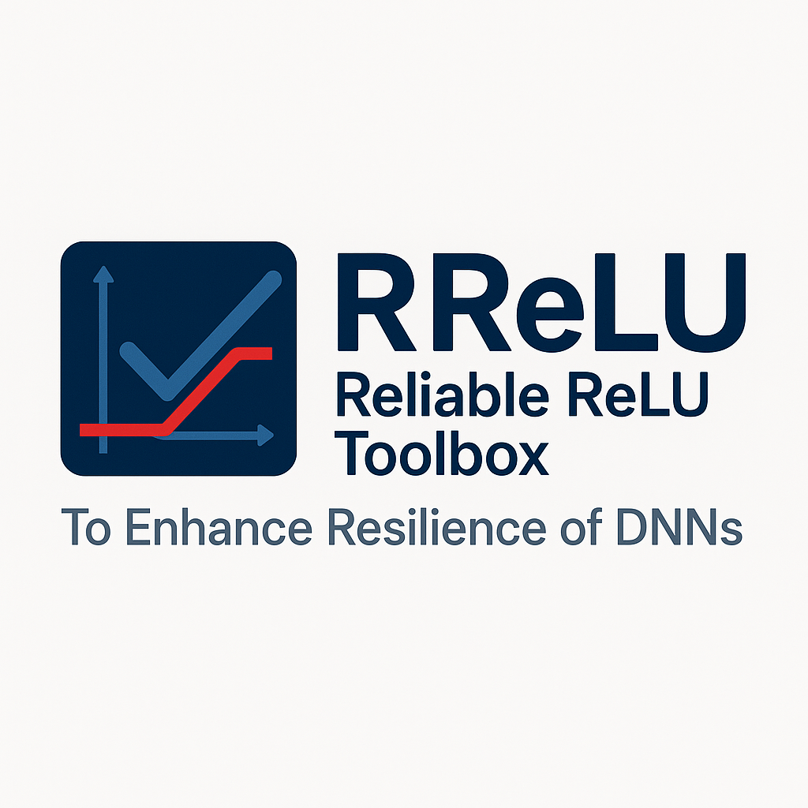

<h1 align="center">
  
  <br/>
    Reliable ReLU Toolbox (RReLU) To Enhance Resilience of DNNs 
  </br>
</h1>
<p align="center">
<a href="#background">Background</a> •
<a href="#usage">Usage</a> •
<a href="#code">Code</a> •
<a href="#citation">Citation</a> •
</p>

## Background
The Reliable ReLU Toolbox (RReLU) is a powerful reliability tool designed to enhance the resiliency of deep neural networks (DNNs) against soft errors by generating reliable ReLU activation functions.
It is implemented for the classification task for the popular PyTorch deep learning platform on the Cifar-10, Cifar-100, and ImageNet datasets.
RReLU allows users to find a clipped ReLU activation function using various state-of-the-art methods.
This tool is highly versatile for dependability and reliability research, with applications ranging from resiliency analysis of classification networks to training resilient models and improving DNN interpretability.

RReLU includes all state-of-the-art activation restriction methods. These methods offer several advantages: they do not require retraining the entire model, avoid the complexity of fault-aware training, and are non-intrusive, meaning they do not necessitate any changes to an accelerator.
RReLU serves as the research code accompanying the paper (ProAct: Progressive Training for Hybrid Clipped Activation Function to Enhance Resilience of DNNs), and it includes implementations of the following algorithms:

* **ProAct** (the proposed algorithm) ([paper](https://arxiv.org/abs/2406.06313) and ([code](https://github.com/hamidmousavi0/reliable-relu-toolbox/tree/master/rrelu/search_bound/proact.py)).
* **FitAct** ([paper](https://arxiv.org/pdf/2112.13544) and [code](https://github.com/hamidmousavi0/reliable-relu-toolbox/tree/master/rrelu/search_bound/fitact.py)).
* **FtClipAct** ([paper](https://arxiv.org/pdf/1912.00941) and [code](https://github.com/hamidmousavi0/reliable-relu-toolbox/tree/master/rrelu/search_bound/ftclip.py)).
* **Ranger** ([paper](https://arxiv.org/pdf/2003.13874) and [code](https://github.com/hamidmousavi0/reliable-relu-toolbox/tree/master/rrelu/search_bound/ranger.py)).

## Usage
```
git clone https://github.com/hamidmousavi0/reliable-relu-toolbox.git
```
## Code Structure
```
- rrelu/
  - models_cifar/ # Define the models architectures for Cifar-10 and Cifar-100 datasets.
  - models_imagenet/  # Define the models' architectures for the  ImageNet dataset.
  - pytorchfi/ # fault-injection library has been adapted to consider bounds parameters as well.
  - relu_bound/ # Bounded ReLU class definition for different methods.
  - search_bound/ # Algorithms for searching the bounds value.
  - utils/ # Some utility functions
  - hubconf.py # Pre-trained models for Cifar-10 and Cifar-100.
  - setup.py # setup functions such as build_dataloader, build_model, replace_act.
- metric.py # Evaluation metrics
- distribution_plot.py # plot distribution of the activation values.
- search.py # run the whole method based on the config.
- search.py # run the whole method based on the config.
- **RReLU.ipynb** # shows the steps for using the RReLU library.
```
### Installing

**From Source**

Download this repository into your project folder.

### Details of the usage

## To-do list
- [x] Support all pretrained models in PyTorch-hub
- [x] Support distributed training and evaluation 
- [ ] Add object detection Task
- [ ] Add Transformers architectures

### Run search in the command line 

When you download this repository into your project folder.
```
torchrun --nproc_per_node=2  search.py --dataset cifar10 --data_path "./dataset/cifar10"  --batch_size 128 --model "resnet20" --n_worker 32 \
                      --name_relu_bound "zero"  --name_serach_bound "ranger" --bounds_type "layer" --bitflip "fixed" --image_size 32 --pretrained_model
```

## Citation

View the [published paper](https://arxiv.org/abs/2406.06313). If you use or reference rrelu, please cite:

```
@article{mousavi2024proact,
  title={ProAct: Progressive Training for Hybrid Clipped Activation Function to Enhance Resilience of DNNs},
  author={Mousavi, Seyedhamidreza and Ahmadilivani, Mohammad Hasan and Raik, Jaan and Jenihhin, Maksim and Daneshtalab, Masoud},
  journal={arXiv preprint arXiv:2406.06313},
  year={2024}
}
```
## Acknowledgment

We acknowledge the National Academic Infrastructure for Supercomputing in Sweden (NAISS), partially funded by the Swedish Research Council through grant agreement no
